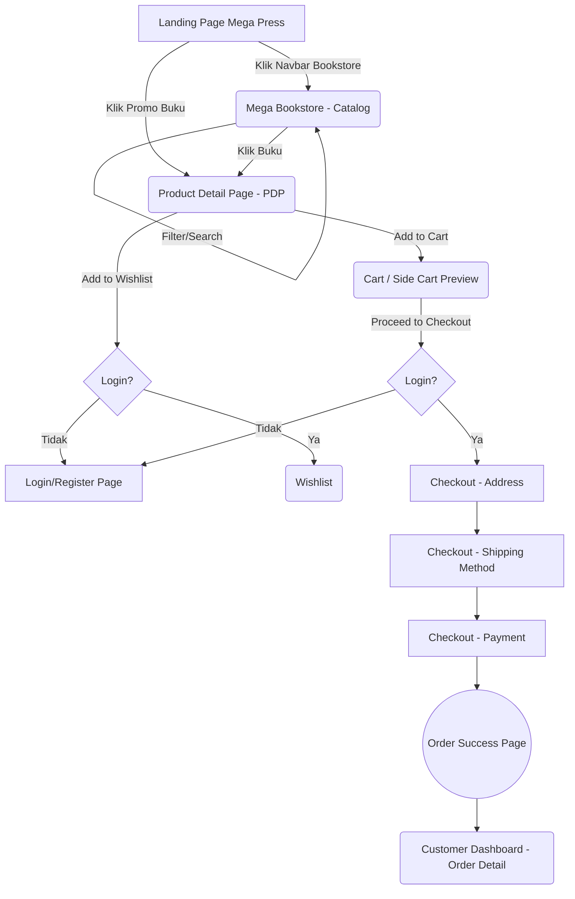

# User Flow & Navigation

Dokumen ini menjelaskan alur navigasi pengguna dan *journey* di dalam ekosistem Mega Press & Mega Bookstore.

## 1. Global Flow Diagram
Di bawah ini adalah diagram *happy path* dari Landing Page hingga pesanan berhasil:

## 2. Rincian Alur
### a. Entry Point & Discovery
- Pengguna mendarat di **Landing Page Mega Press**. Dari sini mereka dapat menjelajah layanan publikasi atau berpindah ke e-commerce melalui link di Header.
- Di **Mega Bookstore**, pengguna disajikan Hero promo, lalu daftar kategori dan rekomendasi. Mereka dapat menggunakan *Search Bar* global untuk mencari buku spesifik.

### b. Engagement & Cart
- Pada **Product Detail Page (PDP)**, pengguna melihat spesifikasi buku, harga, dan CTA (Call to Action).
- Mengklik "Add to Cart" akan menampilkan notifikasi (Toast) dan memperbarui *Badge* keranjang di Header tanpa memaksa pengguna pindah halaman.

### c. Checkout Process (Multi-step)
Setelah pengguna meninjau **Cart Page** dan klik Checkout, mereka masuk ke *funnel* (hanya jika sudah login).
1. **Alamat**: Pilih alamat yang sudah ada (dari profil) atau tambah alamat baru.
2. **Pengiriman**: Pilih antara *Pickup di Kantor* (gratis) atau *Delivery Ekspedisi* (menghitung ongkos kirim dummy).
3. **Pembayaran**: Pilih metode (Transfer Bank, e-Wallet, Kartu Kredit dummy).
4. **Ringkasan**: Tinjauan akhir pesanan (Buku + Ongkir - Diskon).

### d. Post-Purchase & Retention
- Halaman **Order Success** menampilkan Nomor Pesanan dan instruksi pembayaran/pengiriman.
- Pengguna bisa mengakses **Customer Dashboard** (My Orders, Profile, Wishlist) kapan saja melalui menu Dropdown Profil di Header.
